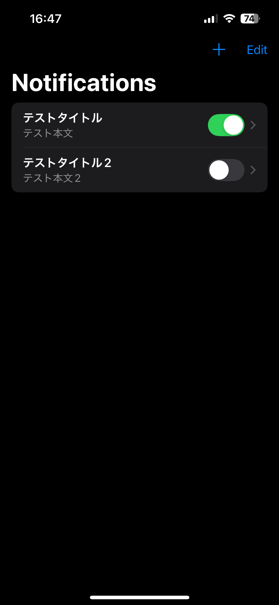

## アプリ名

Notify at random times

## 概要

登録した内容をランダムな時間に通知するiOSアプリケーションです。

## 経緯

決まった時間に通知が来ると、次第に煩わしく感じてしまい、最終的に通知をオフにしてしまうことがあります。このアプリでは、通知が来る時間をランダムにすることで、その問題を解決しようと試みています。

## 画面一覧

- **通知一覧画面**
    - 登録した通知を一覧で表示します。
    - 各項目には、通知のタイトル、本文（長い場合は省略）、通知のオン/オフを切り替えるトグルが表示されます。
    - 通知項目をタップすると、通知詳細画面に遷移します。
    - ナビゲーションバーの「+」ボタンをタップすると、通知追加画面に遷移します。
    - 項目を左にスワイプすることで、通知を削除できます。

- **通知追加画面**
    - 新しい通知を追加する画面です。
    - タイトルと本文を入力し、「Save」ボタンをタップすると内容が保存され、通知一覧画面に戻ります。

- **通知詳細画面**
    - 通知の詳細内容を表示・編集する画面です。
    - タイトル、本文、通知のオン/オフ状態を編集できます。
    - **更新ボタンはなく、この画面を抜けると自動的に変更が保存されます。**
    - 「Delete Notification」ボタンをタップすると、確認ダイアログが表示された後、通知を完全に削除できます。

## 機能

- 通知一覧表示機能
- 通知詳細表示・編集機能
- 通知追加機能
- 通知削除機能
- 通知オン/オフ切り替え機能

## 実装詳細

- **通知時間:** 通知は毎日、**午前9:00から午後10:00（22:00）まで**の間のランダムな時刻に送信されるようにスケジュールされます。
- **データ保存:** データの永続化には`SwiftData`フレームワークを使用しています。
